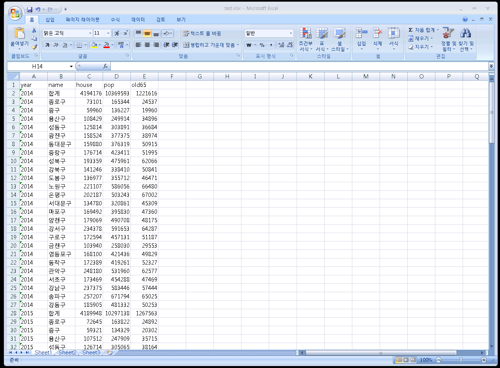
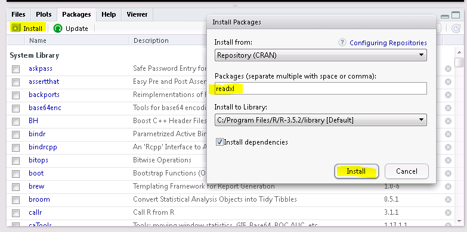

# 외부자료 {#external}


## 예제: 엑셀 화일의 구성

MS 엑셀화일(Miscrosoft Excel file)은 자료를 저장하고 정리하는데 매우 유용한 프로그램이다.  이번에는 R에서 MS 엑셀화일을 불러들여서 데이카프레임 형식으로 저장하는 방법을 소개한다.

아래 그림과 같이 2014-2018년의 서울시 구별 인구정보가 `test.xlsx` 엑셀 화일에 저장되어 있다고 가정하자. 

* 첫 번째 줄은 각 열을 설명하는 변수의 이름이며 영어문자로 구성되어 있다.
* 5개의 변수로 구성된 자료이다. (`year`, `name`, `house`, `pop`, `old65`)
    + `year`: 년도
    + `name` : 구이름
    + `house`: 가구수
    + `pop` : 인구수
    + `old65`: 65세 이상 인구수
* 한 개의 sheet만 있는 화일이다 (참고로 MS 엑셀화일은 여러 개의 sheet으로 구성될 수 있다.)

```{r , echo=FALSE, fig.cap="2018년 서울시 구별 인구 엑셀 화일", out.width = '90%', fig.align='center'}

```

## 패키지의 설치와 이용 지정 

### 패키지 `readxl`의 설치

R은 독자적으로도 여러 가지 다양한 기능을 수행할 수 있는 통계 프로그램이지만 다양한 기능을
제공하는 패키지(poackage)를 설치하면 더욱 편리한 기능을 이용할 수 있다.

MS 엑셀화일은 여러 가지 형식(xls, xlsx, csv, ...)이 있기 때문에 엑셀화일을 수월하게 읽을 수 있는 패키지 `readxl`을 설치하여 이용하면 쉽게 엑셀화일의 자료를 데이터프레임으로 변환하여 사용할 수 있다.

패키지의 설치는 두 가지 방법이 있다.

1. **plot** 패널에서 `packages` 탭을 클릭하면 install 버튼이 있다. install 버튼을 클릭하면 대화창이 뜨고 설치하고자 하는 패키지의 이름을 입력하여 선택한다. 아래 있는 install 버튼을 클릭하면 패키지를 설치해 준다.


```{r , echo=FALSE, fig.cap="Rstudio에서 패키지 설치", out.width = '90%', fig.align='center'}

```


2. R의 **console**화면에서 명령어 `install.packages` 함수를 이용하여 설치한다.

```
install.packages("readxl")
```


### 패키지의 지정 

패키지 `readxl`을 설치한 후 그 기능을 이용하고 싶다면 다음과 같이 `library` 함수를 사용하여 패키지를 지정해 주어야 한다.

```
library(readxl)
```

참고로 패키지의 설치는 최초 한 번만 해주면된다. 하지만 `library` 함수를 이용한 패키지의 지정은 사용할 때마다 실행해 주어야 한다. 

## 엑셀 화일의 입력

### **working directory** 지정

이제 `test.xlsx` 엑셀 화일을 원하는 디렉토리에 저장한다. 

화일을 저장한 디렉토리를 **working directory**로 지정해 주어야 한다. Rstudio 메뉴에서 **session**을 선택하면 **set working directory** 메뉴가 있다. **choose directory**를 선택하고 `test.xlsx` 엑셀 화일을 저장한 디렉토리를 지정해 준다.

### 엑셀 화일의 입력

- `test.xlsx` 엑셀 화일의 자료를 데이터프레임 `seoulpop01` 에 저장해 주려면 다음과 같은 명령어를 실행한다.

```{r}
seoulpop01 <- read_excel("./data/test.xlsx", col_names = TRUE)
seoulpop01
```

위에서 엑셀 화일을 읽을 때 다음과 같은 점을 유의하자.

- 위에서 사용한 함수 `read_excel`은 패키지 `readxl`을 설치해야 사용할 수 있는 함수이다.

- 함수 `read_excel`는 컴마로 분리된 두 가지 인자(arguments)를 받는다. 첫 번째 인자는 문자열로 된 엑셀 화일의 이름이다(`"test.xlsx"`).

- 두 번째 인자 `col_names = TRUE` 는 선택 명령어(options)이며 엑셀 화일 `"test.xlsx"`에서 첫 행이 자료가 아니고 변수의 이름이라는 것을 알려주는 문장이다. 만약 엑셀 화일의 첫 행부터 자료가 시작된다면 `col_names = FALSE` 라고 지정해야 한다.

- `seoulpop01`은 데이터프레임 형식이 아닌 **tibble** 형식이며 이는 데이터프레임의 보다 진화된 형식이라고 볼 수 있다. 

**tibble** 형식의 `seoulpop01`을 데이터프레임 형식인 `seoulpop02`으로 함수 `data.frame` 함수를 이용하여 저장하자.

```{r}
seoulpop02 <- data.frame(seoulpop01)
head(seoulpop02, n=30)
```

## CSV 화일의 입력

많은 경우 자료가 CSV(comma-separated values)화일로 저장된다. CSV 화일은 자료의 값(필드)를 쉼표(,) 또는 여백(space)로 구분한 텍스트 데이터 및 텍스트 파일이다. 확장자는 .csv 이며 이 화일은 MS Excel 프로그램으로 볼 수 있다.


예제 화일인 **seoulpopall.csv**의 실제 내용을 보면 다음과 같다.

```
year,name,house,pop,popm,popf,for,density,area,numhouse,old65
1991,합계,3330317,10904527,5485353,5419174,,18014,605.33,3.27,
1991,종로구,78169,236806,119127,117679,,9865,24.01,3.03,
1991,중구,61495,184142,93312,90830,,18438,9.99,2.99,
```

CSV 화일은 R 에서  함수 `read.table`를 이용하여 자료를 불러 올 수 있다. 아래는 **seoulpopall.csv** 화일의 자료를 불러오는 R 명령어이다.

```{r}
df <- read.table("./data/seoulpopall.csv", sep=",", header = TRUE, fileEncoding = "CP949")
```

함수 `read.table`의 세가지 인자를 설명하면 다음과 같다.

* `"seoulpopall.csv"`: 문자열로 된 csv 화일 이름
* ` sep=","` : 각 변수의 필드가  쉼표(,)로 분리된 것을 지정한다. 만약  여백(space)으로 구분되어 있다면 ` sep=""`로 지정한다.
* `  header = TRUE` : 첫 행이 자료가 아니고 변수의 이름이라는 것을 알려주는 문장이다.


아래는 **seoulpopall.csv** 화일의 자료가 저장된 데이터프레임 `df`의 내용이다.
자료 중에 `NA`로 표시된 부분은 자료가 없는 것, 즉 결측값(missing value, Not Available)을 의미 한다.

```{r}
head(df)
```
