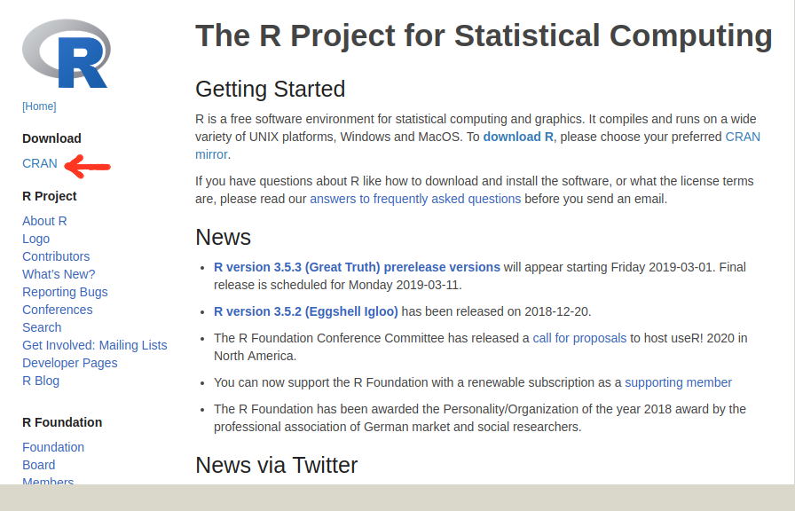
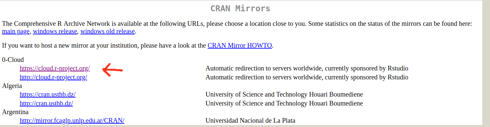
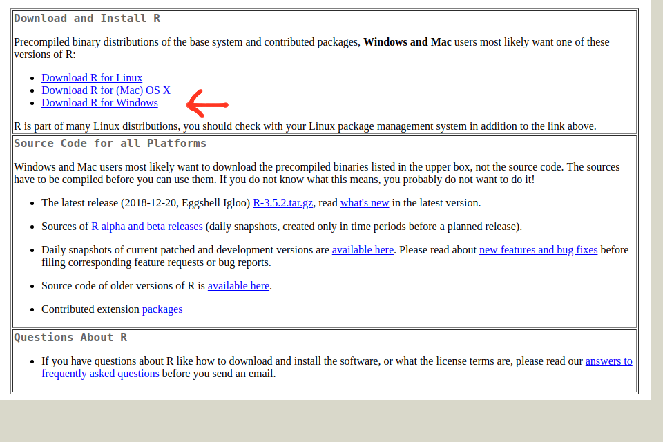
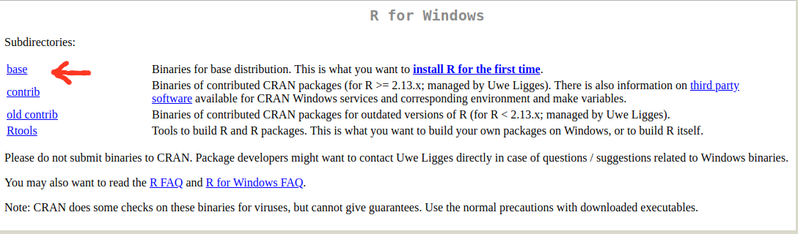
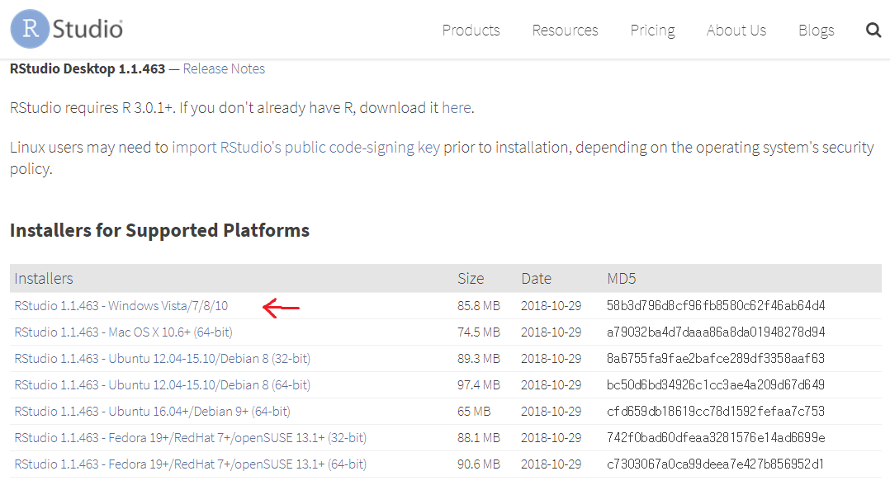
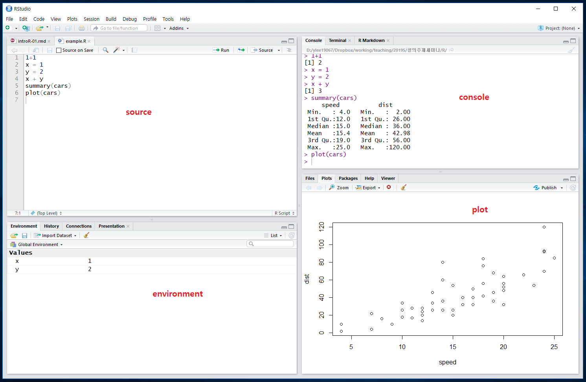

\mainmatter

# R 소개 {#intro}


## 통계패키지 R 

- R은 통계계산과 그래픽을 위한 프로그램 언어(program language)이다.

- R은 프로그램 언어이지만  대화형식(Interactive)으로 실행할 수 있으며 GUI(Graphic User Interface)와 여러 패키지를 포함한 통계분석 시스템을 지칭한다.

- R은 기본적인 통계 계산과 그래픽 기능이 내장되어 있으며 사용자들이 만든 다양한 패키지(packge)를 자유롭게 이용할 수 있다.

- [R home page](http://www.r-project.org/)


## R 다운로드 받기 

R은 무료로 배포하는 통계 계산 및 분석 패키지이다. [R 홈페이지](https://www.r-project.org/) 에서 다운로드 받을 수 있다.

일단 R 홈페이지에 들어가면 왼쪽 상단에 **Download** 메뉴 하단에 **CRAN** 을 클릭하면 프로그램을 다운로드받을 수 있는 페이지로 이동한다. 

```{r , echo=FALSE, fig.cap="R 홈페이지", out.width = '70%', fig.align='center'}

```

다운로드 페이지로 이동하기 전에 R을 다운로드받을 수 있는 서버(server)를 선택하라는 화면이 뜨는데 처음 2개의 클라우드 서버 중에 아무거나 하나를 선택하면 된다. 

```{r , echo=FALSE, fig.cap="클라우드 서버의 선택", out.width = '70%', fig.align='center'}

```

이제 다운로드 페이지에 들어가면 아래와 같은 화면이 뜨는데 자신이 사용하는 컴퓨터 운영체제(Linux, Mac, Windows)중에 하나를 선택하면 된다.

```{r , echo=FALSE, fig.cap="운영체제의 선택", out.width = '70%', fig.align='center'}

```

Windows 운영체제를 선택하면 다음과 같은 화면으로 이동하며 가장 상단의 **base**를 클릭한다.

```{r , echo=FALSE, fig.cap="Windows 운영체제의 선택 후 base 선택", out.width = '70%', fig.align='center'}

```

이제 다운로드 페이지에서 R 프로그램을 클릭하여 설치 프로그램을 다운로드받아서  보통의 프로그램과 같이 실행화일을 클릭하여 안내에 따라 설치하면 된다. 

```{r , echo=FALSE, fig.cap="R 설치 화일의 다운로드", out.width = '70%', fig.align='center'}

```

## Rstudio 다운로드 받기 

Rstudio는 R 언어 작업을 쉽고 효울적으로 할 수 있는 통합개발환경을 제공해주는 프로그램이다. Rstudio [다운로드 페이지](https://www.rstudio.com/products/rstudio/download/)에 가서 설치 프로그램을 다운로드받아서 설치할 수 있다. RStudio Desktop (Open Source License) 무료 버젼을 선택하고 자신이 사용하는 운영체제에 따라 설치프로그램을 받아 설치한다.  

```{r , echo=FALSE, fig.cap="RStudio Desktop 무료 Windows 64 bit 버젼 다운로드", out.width = '70%', fig.align='center'}

```

다운로드한 설치 프로그램을 통하여 Rstudio를 설치하고 실행하면 다음과 같은 화면이 나타난다. 

```{r , echo=FALSE, fig.cap="RStudio 화면", out.width = '85%', fig.align='center'}

```
Rstudio의 화면은 위에서 본것과 같이 4개의 영역으로 분할되어 나타나는데 각각의 영역은 다음과 같은 기능을 가진다.

- **source** : R 프로그램이 저장된 화일(확장자는 `.R`)을 새로 만들거나 불러와서 편집할 수 있으며 명령문을 직접 실행할 수 있다. 실행할 명령문으로 커서를 옮긴 다음 `ctrl-enter` 키를 누르면 그 결과가 console 화면에 출력된다.

- **console** : 대화창(Interactive mode)에서 직접 R 명령어를 입력할 수 있다.  대화창은  `>` 표시가 있으며 이를 프롬프트(prompt)라고 하며 여기서 명령어를 입력하고  `enter`를 치면 곧바로 결과를 얻을 수 있는 환경을 제공한다.

- **environment** : R 명령어를 실행하면서 생긴 객체들의 현황을 보여주고 또한 지난 명령어의 목록(history)를 보여준다.

- **plot**: 그림의 결과를 출력하여 보여주고 `package`를 설치하고 그 현황을 보여준다.  또한 R언어와 `package`의 도움말이 제공된다.  
